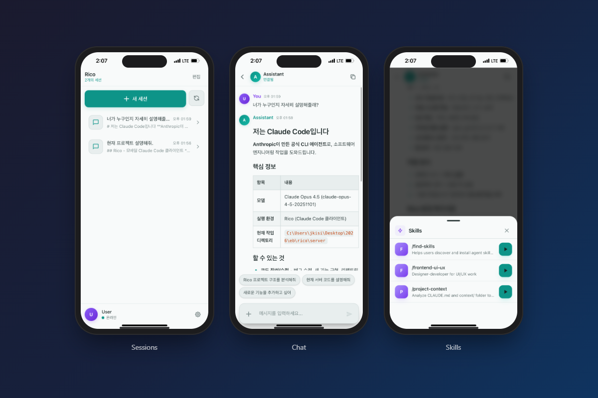

# Rico

**Remote Claude Code Operator**

[English](../README.md) | [한국어](README-ko.md) | [简体中文](README-zh.md) | [日本語](README-ja.md) | Español | [Português (BR)](README-pt-br.md) | [Français](README-fr.md) | [Русский](README-ru.md) | [Deutsch](README-de.md)

### Q. ¿Qué es esto?

**A. Lo hice porque quería trabajar con Claude Code mientras estoy acostado.**

Es un cliente PWA que permite usar Claude Code en dispositivos móviles. Se comunica con Claude Code CLI a través de un servidor puente en Go y proporciona respuestas rápidas mediante conexiones WebSocket en tiempo real.



## Características

- **Mobile-First PWA**: Instalar en la pantalla de inicio y usar como una app nativa
- **Chat en tiempo real**: Conversación en tiempo real basada en WebSocket
- **Notificaciones push**: Alertas push cuando llegan nuevos mensajes
- **Explorador de archivos**: Navegar por el sistema de archivos del servidor y ver archivos
- **Gestión de sesiones**: Guardar y gestionar sesiones de conversación
- **Sistema SOUL**: Persona de IA personalizable
- **Skills**: Funciones extendidas mediante comandos slash
- **i18n**: Soporte multilingüe (coreano/inglés)

## Stack tecnológico

| Componente | Tecnología |
|------------|------------|
| Frontend | Svelte 5, Vite 7, TypeScript, Tailwind CSS |
| Backend | Go (gorilla/websocket) |
| Comunicación | WebSocket + REST API |
| Despliegue | PWA (Progressive Web App) |

---

## Requisitos

### Prerrequisitos

| Requisito | Versión | Propósito |
|-----------|---------|-----------|
| Node.js | 18+ | Build del frontend |
| Go | 1.21+ | Build del servidor |
| Claude Code CLI | latest | Comunicación con IA |
| HTTPS + Dominio | - | Requisito de PWA (ver abajo) |

### Por qué se necesitan HTTPS y dominio

Las funciones principales de PWA (Service Worker, notificaciones push, instalación en pantalla de inicio) **solo funcionan sobre HTTPS** por razones de seguridad. Además, se necesita un **dominio** para obtener certificados SSL.

Hay varias formas de obtener un dominio y certificados SSL, pero este proyecto usa Tailscale. También puedes usar otros métodos (Cloudflare Tunnel, ngrok, dominio propio, etc.).

---

## Configuración de Tailscale (método usado en este proyecto)

Tailscale es un servicio VPN que también proporciona dominios y certificados SSL gratuitos. Es conveniente cuando quieres una configuración HTTPS sencilla para proyectos personales.

### 1. Instalar Tailscale

**PC (computadora donde se ejecutará el servidor):**
- Instalar desde https://tailscale.com/download para tu SO
- Iniciar sesión después de la instalación (Google, GitHub, etc.)

**Móvil:**
- Instalar "Tailscale" desde App Store / Play Store
- Iniciar sesión con la **misma cuenta**

### 2. Verificar dominio

Después de instalar Tailscale, ejecutar en terminal:

```bash
tailscale status
```

Ejemplo de salida:
```
100.94.195.110  your-machine    your-email@...
```

Formato de dominio: `your-machine.tail1234.ts.net`

> También puedes verificar en la Consola de Admin de Tailscale (https://login.tailscale.com/admin)

### 3. Obtener certificado SSL

```bash
# Obtener certificado (gratuito)
tailscale cert your-machine.tail1234.ts.net
```

Archivos generados:
- `your-machine.tail1234.ts.net.crt` (certificado)
- `your-machine.tail1234.ts.net.key` (clave privada)

Copia estos archivos a la carpeta `server/certs/`.

---

## Instalación de Claude Code CLI

```bash
# Instalar via npm
npm install -g @anthropic-ai/claude-code

# Iniciar sesión
claude login
```

> Disponible después de iniciar sesión en Claude Code CLI. No se necesita configuración de API key por separado.

---

## Instalación

### 1. Clonar

```bash
git clone https://github.com/Epsilondelta-ai/rico.git
cd rico
```

### 2. Generar claves VAPID

Primero, genera las claves VAPID para notificaciones push:

```bash
npx web-push generate-vapid-keys
```

Ejemplo de salida:
```
=======================================

Public Key:
BNlx...your_public_key...

Private Key:
abc1...your_private_key...

=======================================
```

Guarda estas claves. Se usarán en la configuración siguiente.

### 3. Configuración del servidor

```bash
cd server
go mod download
cp .env.example .env
```

Editar `server/.env`:
```env
# Claves VAPID (generadas arriba)
VAPID_PUBLIC_KEY=BNlx...your_public_key...
VAPID_PRIVATE_KEY=abc1...your_private_key...

# Puerto del servidor
SERVER_PORT=8080

# Certificado SSL (rutas a archivos de Tailscale)
SSL_CERT_FILE=./certs/your-machine.tail1234.ts.net.crt
SSL_KEY_FILE=./certs/your-machine.tail1234.ts.net.key
```

### 4. Configuración del frontend

```bash
cd ../web
npm install
cp .env.example .env
```

Editar `web/.env`:
```env
# Dirección del servidor API (usar dominio de Tailscale)
VITE_API_BASE=https://your-machine.tail1234.ts.net:8080

# Clave pública VAPID (misma que server/.env)
VITE_VAPID_PUBLIC_KEY=BNlx...your_public_key...
```

### 5. Compilar y ejecutar

Ejecutar desde la raíz del proyecto (`rico/`).

**Windows:**
```bash
scripts\run-windows.bat
```

**Linux/macOS:**
```bash
chmod +x scripts/run-linux.sh   # solo la primera vez
./scripts/run-linux.sh
```

El script maneja en orden: instalación de dependencias → build del frontend → build del servidor → inicio del servidor.

Log de éxito:
```
Rico 설정 로드 완료:
  - RICO_BASE_PATH: /path/to/rico
  - SERVER_PORT: 8080
Rico 브릿지 서버 시작 (HTTPS): :8080
```

### Acceder desde móvil

1. Ejecutar la app Tailscale en el móvil (verificar conexión)
2. Acceder a `https://your-machine.tail1234.ts.net:8080` en el navegador

**iOS (Safari):**
3. Tocar botón de compartir → Seleccionar **"Añadir a pantalla de inicio"**
4. Instalación PWA completada

**Android (Chrome):**
3. Menú (⋮) → Seleccionar **"Añadir a pantalla de inicio"** o **"Instalar app"**
4. Instalación PWA completada

> Este proyecto fue probado en iOS Safari. Se espera que funcione en Android pero no ha sido probado.

---

## Estructura del proyecto

```
rico/
├── scripts/
│   ├── run-windows.bat     # Build & ejecución Windows
│   └── run-linux.sh        # Build & ejecución Linux/macOS
├── web/                    # Svelte PWA Frontend
│   ├── src/
│   │   ├── App.svelte
│   │   └── lib/
│   │       ├── ChatScreen.svelte
│   │       └── websocket.ts
│   ├── .env.example
│   └── package.json
├── server/                 # Go Bridge Server
│   ├── main.go
│   ├── certs/              # Carpeta de certificados SSL
│   └── .env.example
├── context/                # Sistema de contexto
│   ├── personas/           # Configuración de personas
│   │   ├── active.json     # Persona activa actual
│   │   └── default/        # Persona por defecto
│   │       ├── SOUL.md
│   │       └── config.json
│   └── ...
├── CLAUDE.md               # Reglas del Agent
└── README.md
```

---

## Configuración

### Resumen de variables de entorno

#### Servidor (`server/.env`)

| Variable | Requerido | Descripción |
|----------|-----------|-------------|
| `VAPID_PUBLIC_KEY` | Sí | Clave pública de notificaciones push |
| `VAPID_PRIVATE_KEY` | Sí | Clave privada de notificaciones push |
| `SERVER_PORT` | No | Puerto del servidor (por defecto: 8080) |
| `SSL_CERT_FILE` | Sí | Ruta del archivo de certificado SSL |
| `SSL_KEY_FILE` | Sí | Ruta del archivo de clave SSL |

#### Web (`web/.env`)

| Variable | Requerido | Descripción |
|----------|-----------|-------------|
| `VITE_VAPID_PUBLIC_KEY` | Sí | Clave pública de notificaciones push (misma que el servidor) |
| `VITE_API_BASE` | Sí | Dirección del servidor API (https://...) |

---

## Personalización

### SOUL (Persona de IA)

Puedes personalizar la personalidad, estilo de habla y comportamiento de la IA editando `context/personas/default/SOUL.md`.

```markdown
# SOUL

You are a Claude Code agent. Respond naturally.
```

La configuración por defecto incluye instrucciones mínimas, permitiendo que Claude responda de forma natural. Puedes añadir personas detalladas según sea necesario.

### Idioma (i18n)

Puedes cambiar el idioma en el menú de configuración de la app. Actualmente soporta coreano e inglés.

**Añadir un nuevo idioma:**

1. Crear `{código_idioma}.json` en la carpeta `web/src/locales/` (ej: `ja.json`)
2. Copiar la estructura de `ko.json` y traducir
3. Editar `web/src/lib/i18n.ts`:
   ```typescript
   import ja from '../locales/ja.json';
   addMessages('ja', ja);
   ```
4. Actualizar la UI de cambio de idioma (SessionListScreen.svelte)

---

## Solución de problemas

### Las notificaciones push no funcionan

- Verificar que las claves VAPID estén correctamente configuradas
- Confirmar que las **claves públicas son idénticas** en `server/.env` y `web/.env`
- Verificar que los permisos de notificación estén permitidos en el navegador

### La conexión HTTPS no funciona

- Verificar que Tailscale esté conectado tanto en PC como en móvil
- Comprobar que las rutas de los archivos de certificado SSL sean correctas
- Verificar que el certificado no haya expirado (necesita renovación cada 3 meses)
  ```bash
  tailscale cert your-machine.tail1234.ts.net  # re-emitir
  ```

### Error "No se puede conectar al sitio"

- Verificar que el servidor esté en ejecución
- Confirmar que la app Tailscale esté conectada en el móvil
- Comprobar que la dirección del dominio sea correcta

### Sin respuesta de Claude Code

- Verificar que hayas iniciado sesión con `claude login`
- Revisar los logs del servidor en busca de errores: `server/logs/`
- Probar si Claude Code CLI funciona correctamente:
  ```bash
  claude "Hello"
  ```

---

## Desarrollo

### Desarrollo local (HTTP)

Para probar localmente sin certificados SSL:

**Terminal 1 - Servidor:**
```bash
cd server
# Comentar SSL_CERT_FILE, SSL_KEY_FILE en .env
go run main.go
```

**Terminal 2 - Frontend:**
```bash
cd web
npm run dev
```

> Nota: En modo HTTP, las notificaciones push, instalación PWA, etc. no funcionarán.

---

## Nota

Esta es una herramienta auto-alojada que se ejecuta en tu escritorio personal. No incluye un sistema de autenticación integrado, así que por favor gestiona la seguridad a través del control de acceso a la red (ej: Tailscale VPN).

---

## Contribuir

Issues y Pull Requests son bienvenidos.

### Configuración del entorno de desarrollo

1. Fork & Clone de este repositorio
2. Seguir los pasos de [Instalación](#instalación) para configurar el entorno
3. Consultar la sección de [Desarrollo](#desarrollo) para ejecutar el servidor de desarrollo local

### Guías para PR

- Escribir mensajes de commit en inglés
- Seguir el estilo de código existente
- Incluir una descripción de los cambios en el cuerpo del PR cuando sea posible

---

## Licencia

MIT License - ver [LICENSE](LICENSE)
